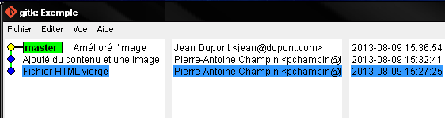
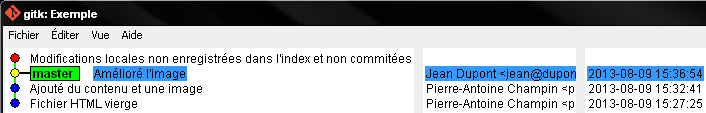
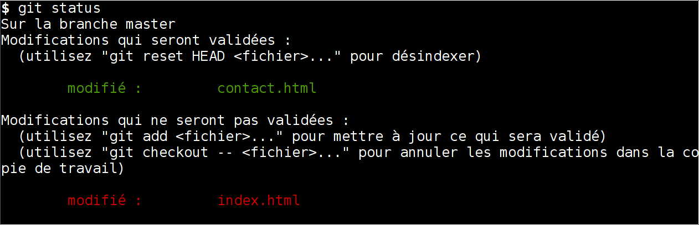
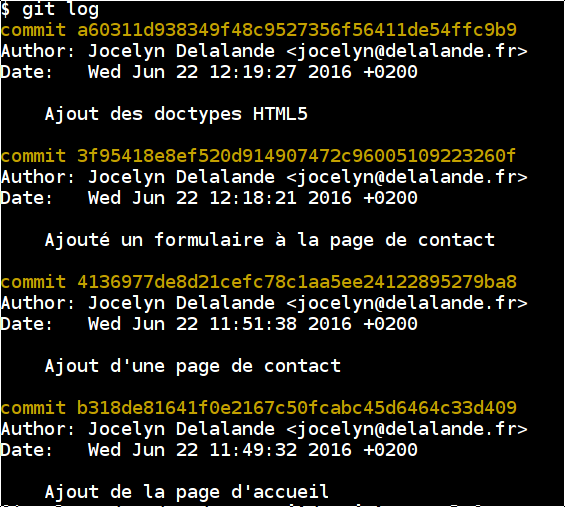

.. Introduction à GIT slides file, created by
   hieroglyph-quickstart on Fri Aug  9 13:28:46 2013.
   Modifié le 28 juillet 2014 par acordier

:tocdepth: 3

====================
 Introduction à GIT
====================

.. raw:: html

   <!-- NB: using raw:: directive in order to accurately tag metadata -->

     <a rel="author">
       <a href="http://iut.univ-lyon1.fr/">Dépt. Informatique IUT Lyon 1</a>
     </a> &
       <a rel="author" href="jocelyn.delalande.fr">
         Jocelyn Delalande
       </a>

     <a rel="license"
        href="http://creativecommons.org/licenses/by-sa/3.0/fr/deed.en">
        <p></p></a>

     <p class="license">Ce travail est sous licence
     <a rel="license"
        href="http://creativecommons.org/licenses/by-sa/3.0/fr/deed.fr">
        Creative Commons Attribution-ShareAlike 3.0 France</a>.</p>


.. |VCS| raw:: html

      <abbr title="Version Control Systems">VCS</abbr>

.. role:: eng

.. role:: del


Motivations
===========

Exemple 1
+++++++++

.. figure:: _static/motivation1.*
   :width: 100%

.. note::

   * la version la plus à jour est-elle ``Rapport.doc`` ou
     ``Rapport_VFinale.doc``\ ?
   * et si on avait aussi ``Rapport_VFinale1.doc`` et ``Rapport_VFinale2.doc``
     (expérience vécue) ?
   * les versions n'apparaissent pas dans l'ordre (1.1, 1, 2)
   * la version 2-jd vient elle avant ou après la version 2 ?


Exemple 2
+++++++++

.. figure:: _static/motivation2.*
   :width: 100%

.. note::

   * les versions de l'image sont elles numérotées indépendamment,
     ou par rapport aux versions de la page ?
   * nécessité de renommer les fichiers pour visualiser une ancienne version
     (pour que les liens fonctionnent)

Histoires vraies
++++++++++++++++

* Après que nous avons échangé avec un collègue des versions d'un fichier
  nommées ``X_1.1.doc``, ``X_1.2.doc``, ``X_1.3.doc`` (et ainsi de suite),

  il a nommé la version finale ``X_1.0.doc`` ...

* Un autre collègue m'a envoyé, le 15 mars 2013,
  un fichier nommé ``2013-03-17-xxx`` .

  Je l'ai modifié le 16 mars ; quel nom lui donner ?...

Conclusion
++++++++++

* La gestion des versions est un travail fastidieux et méthodique.

* Les humains ne sont pas doués pour les travaux fastidieux et méthodiques.

* Laissons cela à l'ordinateur,

  - et concentrons-nous sur la partie du travail
    où nous sommes meilleurs que l'ordinateur.

→ |VCS| (`Version Control System`:eng:)

Avertissement
-------------

* GIT (se prononce « guite ») est un outil extrêmement riche ;

  - nous n'en verrons qu'une partie dans ce module.

* Ne vous laissez pas effrayer par l'interface « touffue » ;

  - faites confiances aux réglages par défaut (dans un premier temps).


.. figure:: _static/logogit.png
   :width: 20%


Historique des |VCS|
====================

Origines
++++++++

* Initialement dédiés à la gestion de code source pour les projets logiciels
* mais également :

  - documentation
  - site web

* travail collaboratif :

  - facilité d'échange
  - traçabilité
  - gestion des conflits

Évolutions
++++++++++

**Systèmes centralisés**

* CVS_ (Concurrent Versioning System, vieillissant)
* SVN_ (Subversion, très populaire, mais c'est en train de changer)

**Systèmes décentralisés**

* GIT_
* Mercurial_ (Hg)
* Bazaar_ (bzr)

→ facilitent une utilisation individuelle

.. _CVS: http://savannah.nongnu.org/projects/cvs/
.. _SVN: https://subversion.apache.org/
.. _GIT: http://git-scm.com/
.. _Mercurial: http://mercurial.selenic.com/
.. _Bazaar: http://bazaar.canonical.com/en/

Notions de base
===============

Bon exemple
+++++++++++

.. figure:: _static/motivation3.*
   :width: 100%

.. note::

   Le répertoire ``.git`` est un répertoire caché,
   qui contient tout l'historique des fichiers.

Les avantages de la gestion de versions
+++++++++++++++++++++++++++++++++++++++

* Sauvegarde (modulo la synchronisation avec un serveur distant)
* Conservation de l'historique (nominatif) des fichiers (qui a fait quoi ?)
* Possibilité de retour en arrière
* Fusion des modifications lors du travail collaboratif
* Visualiser les changements au cours du temps


Notions
+++++++

.. contents::
   :local:
   :depth: 0
   :backlinks: none

.. index:: dépôt, repository

Dépôt (:eng:`repository`)
-------------------------

Un **dépôt** (en anglais :eng:`repository`) est l'historique complet d'un
répertoire de fichiers ; il inclut en détail toutes les modifications apportées
au répertoire, ses fichiers et leur contenu. Le dépôt lui-même  est contenu
dans un répertoire caché ``.git``.

À côté du dossier ``.git`` on a généralement une vue des fichiers contenus à
un certain point de l'historique, que l'on peut observer ou modifier.

.. note::
   On ne modifie jamais directement le contenue du ``.git``, on le manipule, à
   l'aide d'outils comme la commande ``git``.

.. index:: commit, révision

Commit
------

L'historique d'un projet est une séquence de « photos »,
contenant l'état de tous les fichiers du projet.

Ces « photos » s'appellent des **commits**,
et possèdent :

* une date
* un auteur
* une description textuelle
* un lien vers le(s) commit(s) précédent(s)

Illustration
````````````



   Visualisation d'un historique simple
   dans un outil graphique.

NB : on ignore pour l'instant le rectangle ``master``\ ;
on l'expliquera par la suite.


Copie de travail
----------------

On appelle **copie de travail** (en anglais `working copy`:eng:)
les fichiers effectivement présents dans le répertoire géré par GIT.

Leur état peut être différent du dernier commit de l'historique.




.. index:: index

Index
-----

L'index est un espace temporaire contenant les modifications
prêtes à être « commitées ».

Ces modifications peuvent être :

* création de fichier
* modification de fichier
* suppression de fichier

État de l'index
+++++++++++++++

La commande ``git status`` permet de savoir où on en est :




.. note::
   On remarque le code couleur :

   * rouge : changements non indexés, non commités
   * vert :  changements indexés, non commités


Mise en œuvre
+++++++++++++

.. note::
   Nous utiliserons dans ce cours la ligne de commande ``git`` ; notez qu'il
   existe également différentes interfaces graphiques plus ou moins complètes
   pour manipuler des dépôts git telles ``gitk`` ou ``gitg``.

Création du dépôt
-----------------

Initialise la gestion de version dans un répertoire
en créant le sous-répertoire ``.git``::

  $ git init

.. index:: commiter

Commiter des modifications
--------------------------

Une fois les fichiers modifiés et dans un état satisfaisant,
vous pouvez les commiter.

Remarque : lorsque vous effectuez un commit, il est essentiel
 d'écrire un message accompagnant le commit. Ce message doit  
 être informatif quant à la nature des modifications que vous 
 êtes en train de commiter. 

Par exemple, *blip* est un **mauvais** message de commit, mais 
 *Correction des fautes d'orthographe dans la doc technique* 
 est un **bon** message de commit. 

Notez qu'en cas de problème, il est possible de corriger un commit
 (tant qu'il n'a pas été partagé avec d'autres collaborateurs), 
 mais nous étudierons cela plus tard. 


.. nextslide::

Ajouter un fichier dans l'index ::

  $ git add <filename>

Retirer un fichier de l'index ::

  $ git reset <filename>

Pour voir l'état des modifications en cours ::

  $ git status
  $ git diff

Pour commiter les modifications indexées ::

  $ git commit    #ou
  $ git commit -m "message de commit"


.. index:: git log, git show

Consulter l'historique
----------------------

  - afficher la liste des commits ::

      $ git log

    (avec l'identifiant de chaque commit)



_
  - afficher le détail d'un commit particulier ::

      $ git show <id-commit>

.. _git-log:


Résumé des états possibles d'un fichier avec GIT
------------------------------------------------

.. figure:: _static/git-states.png
   :width: 50%

   Figure empruntée à git-scm.org_.

.. _git-scm.org: http://git-scm.com/


.. rst-class:: exercice

Exercice - Préambule
````````````````````

Lorsque vous utilisez git, il peut être utile de le configurer
 pour préciser votre nom d'utilisateur et votre adresse email, 
 informations utilisées par GIT pour identifier vos commits ainsi que l'éditeur
 de texte à utiliser pour vos commits.

À faire une seule fois par machine que vous utilisez (paramètres globaux) ::

  $ git config --global user.name "Your Name"
  $ git config --global user.email "you@example.com"
  $ git config --global core.editor "gedit"

.. note::
   Ces paramètres sont bien entendu à personaliser.
 
.. rst-class:: exercice

Exercice
````````

#. Créez un nouveau dépôt git dans un dossier vide. Créez dans ce dernier un
   nouveau répertoire (``mkdir``) puis observez le contenu du répertoire
   créé.

#. Avec un éditeur de texte, créez un fichier texte dans le répertoire, ajoutez du contenu à ce fichier, et sauvegardez-le.

#. Utilisez ``git status`` pour comprendre ce qui se passe.

#. Entraînez-vous à faire des commits : 
   modifiez votre fichier texte, et sauvegardez-le,
   utilisez la ligne de commande pour faire un commit des modifications,
   et répétez l'opération plusieurs fois pour bien comprendre le processus. 

#. Ajoutez maintenant quelques fichiers dans votre répertoire (fichiers textes, images, etc.) et assurez-vous de bien commiter ces nouveaux fichiers. 

..   * Créer votre projet GIT pour gérer votre CV en HTML
..   * Faites plusieurs commit (par exemple, après avoir rempli chaque section)
..   * Ajoutez des fichiers (par exemple, une photo, une feuille de style)


.. _naviguer:


Naviguer dans l'historique
==========================

Motivation
++++++++++

L'intérêt d'utiliser un |VCS| est de pouvoir consulter n'importe quelle version antérieure du projet.

⚠ Attention cependant :

* à ne pas avoir de modification non commitée
  lorsque vous commencez à naviguer dans l'historique ;

* à ne pas faire de modification sur une version ancienne.

Dans les deux cas, vous risqueriez de perdre ces modifications
(GIT affiche d'ailleurs des messages d'avertissement).


.. index:: git checkout

Mise en œuvre
+++++++++++++

::
  $ git checkout <revision>

Expressions de révision
+++++++++++++++++++++++

Il existe plusieurs méthodes pour spécifier une révision à GIT :

.. contents::
   :local:
   :depth: 0
   :backlinks: none

(liste non exhaustive)

Identificateur
--------------

Chaque commit a un identificateur, affiché par la commande ``git log``
(cf. `figure <git-log>`:ref:).

On peut spécifier une révision en utilisant

  - l'identifiant complet du commit, ou
  - un préfixe non ambigu de cet identifiant.

Exemple ::

  $ git checkout 9a063f5fd514e966837163ceffaec332ce66fdff    # ou
  $ git checkout 9a063

Relatif
-------

``HEAD~`` ou ``HEAD~1`` désignent le parent du commit courant.
Ainsi ::

  $ git checkout HEAD~

permet de remonter d'un commit dans l'historique.

NB : ``HEAD~2`` remonte de deux commits, ``HEAD~3`` de trois commits,
et ainsi de suite.

Date
----

``@{<date>}`` désigne l'état du dépôt à la date donnée,
qui peut être exprimée de multiples manières ::

  $ git checkout "@{9:00}"                # ce matin à 9h
  $ git checkout "@{yesteday}"            # hier à 00:00
  $ git checkout "@{3 days ago}"          # il y a 3 jours
  $ git checkout "@{2013-08-15 12:00}"    # le 15 août à midi

.. note::

   Les dates portent sur l'état du dépôt local,
   *pas* sur les dates des commits.

   Du coup, il n'est pas possible avec cette notation
   de naviguer dans un historique *importé* depuis un dépôt distant.

.. index:: git checkout

Retour au présent
+++++++++++++++++

  $ git checkout master

NB : ceci est en fait un cas particulier de l'action `changer_de_branche`:ref:
que nous étudierons un peu plus tard.


.. rst-class:: exercice
 
Exercices
---------

   #. Naviguez dans l'historique de votre dépôt créé précédemment 
      en remontant par exemple 1, 5, 30 minutes en arrière.

   #. `clonez <git-clone>`:ref: (dans un autre dossier) le repository suivant :

   http://champin.net/enseignement/intro-git/historique-images

   Décrivez l'image que contient chacun des commits.

   .. note::

      On verra plus tard en détail la notion de clonage.


Entractes
+++++++++++

Nous venons de voir les fonctionnalités les plus basiques de GIT,
qui permettent de gérer `efficacement`:del: correctement
l'historique d'un ensemble de fichiers
→ à utiliser *sans modération*.

Dans la suite, nous allons étudier des fonctionnalités un peu plus avancées,
qui seraient in-envisageables avec une gestion « manuelle » de l'historique.

  - elle peuvent donc vous sembler superflues,
  - mais s'avèrent vite indispensables quand on y a pris goût.


Branches
========

Motivation
++++++++++

Dans certaines situations, on peut souhaiter faire cohabiter et évoluer
*plusieurs* versions divergentes du même projet.

Ces versions peuvent parfois converger à nouveau (mais pas forcément).

.. note::

   Les copies d'écran de ces exemples sont faites avec
   un autre logiciel que les précédentes,
   ce qui explique le code couleur différent.

.. _exemple-cv:

Exemple 1 : CV
--------------

Pour un CV, on souhaite avoir :

* une version « maître » que l'on maintient à jour,
* des variantes pour chaque demande d'emploi,
  adaptées en fonction de l'employeur visé.

Illustration
````````````

.. figure:: _static/branches_cv.*
   :width: 60%

.. note::

   L'historique n'a plus une structure linéaire, mais *arborescente*
   (ce qui justifiera la métaphore de la « branche »).


.. _exemple-siteweb:

Exemple 2 : site web
--------------------

Pour un site web, on souhaite avoir :

* la version publiée,
* une version de travail,
  dans laquelle on apporte des modifications incrémentales.

Les deux versions mènent leur existence en parallèle,
la version publiée étant régulièrement mise à jour
par rapport à la version de travail.

Illustration
````````````

.. figure:: _static/branches_siteweb.*
   :width: 60%

.. note::

   L'historique n'est même plus un arbre,
   mais un graphe orienté sans cycle.

.. _exemple-logiciel:

Exemple 3 : logiciel
--------------------

Dans un projet logiciel, on souhaite avoir :

* la version stable, dans laquelle on se contente de corriger des bugs, et
* une ou plusieurs versions expérimentales,
  dans lesquelles on implémente de nouvelles fonctionnalités ;

Une fois au point,
chaque nouvelle fonctionnalités est intégrée à la version stable.

Illustration
````````````

.. figure:: _static/branches_logiciel.*
   :width: 80%

.. index:: branche, sommet, tip

Notions
+++++++

Une **branche** est la *lignée* (généalogique) d'un commit particulier,
appelé le sommet (en anglais `tip`:eng:) de cette branche.

.. note::

   Par « lignée », on entends :
   l'ensemble des commits ancêtres du sommet de la branche.

   Dans le cas simple, cette lignée a une structure linéaire,
   mais ce n'est pas toujours le cas
   (comme en témoignent dans les illustrations ci-avant
   la branche ``publié`` dans l'`exemple du site web <exemple-siteweb>`:ref:
   et la branche ``master`` dans
   l'`exemple du logiciel <exemple-logiciel>`:ref:).

En temps normal :

* la copie de travail est synchronisée avec le sommet d'une branche
  (``master`` par défaut),

* à chaque nouveau commit,
  le sommet de la branche courante est avancé vers ce nouveau commit.

.. index:: accessible

Accessibilité
-------------

Un commit est **accessible** s'il appartient à une branche. Les commits non accessibles sont automatiquement supprimés par GIT.

.. note::

   Cette suppression n'est cependant pas immédiate.
   Il est donc parfois possible de « sauver »
   un commit devenu récemment inaccessible,
   en créant une nouvelle branche avant sa suppression effective.

Lorsqu'on `navigue dans l'historique <naviguer>`:ref:,
on lie la copie de travail à un commit particulier plutôt qu'à une branche
(mode `detached HEAD`:eng:).

→ Les commits que l'on ferait dans cet état n'appartiendraient à aucune branche
et seraient donc perdus.

Mise en œuvre
+++++++++++++

.. contents::
   :local:
   :depth: 0
   :backlinks: none


.. index:: git branch

Afficher la liste des branches
------------------------------

::
    $ git branch

  Le nom de la branche courante apparaît précédé d'une étoile.

Créer une nouvelle branche
--------------------------

Cette opération consiste à placer, sur un commit existant,
le sommet d'une *nouvelle* branche
(qui pourra croître indépendamment des autres).


.. index:: git branch, git checkout

Pour créer une nouvelle branche sur le commit courant ::

  $ git branch <nom_nouvelle_branche>

Pour créer une nouvelle branche à un autre emplacement ::

  $ git branch <nom_nouvelle_branche> <revision>

Ces commandes ne changent pas la branche courante.
Pour créer une nouvelle branche *et* en faire la branche courante,
utilisez plutôt ::

  $ git checkout -b <nom_nouvelle_branche>    # ou
  $ git checkout -b <nom_nouvelle_branche> <revision>

.. _changer_de_branche:

Changer de branche
------------------

Cette opération consiste à modifier la copie de travail
pour la mettre dans le même état que le sommet d'une branche.

.. hint::

  Pour pouvoir l'effectuer, il est nécessaire que
  la copie de travail ne contienne aucune modification non commitée.

::
   $ git checkout <branche>


.. index:: git checkout

À propos de ``git checkout``
````````````````````````````
 
La commande ``git checkout`` est utilisée dans divers contextes,
qui rendent difficile à percevoir sa cohérence interne.

La fonction première de cette commande est de
*modifier l'état de la copie de travail*.
Selon ses arguments, elle a des effets supplémentaires :

* un branche : changer la branche courante
* une révision : passer en mode *detached HEAD*


.. index:: fusion, merge

Fusionner deux branches
-----------------------

L'opération de **fusion** (en anglais `merge`:eng:)
permet d'intégrer les modifications d'une branche dans une autre.

.. note::

   GIT permet également de fusionner
   plus de deux branches dans une même opération,
   mais nous n'irons pas jusque là dans ce cours.

Il y a deux situations possibles,
selon les positions relatives de la branche à fusionner (source)
et de la branche destination.

.. index:: fast forward

Fusion sans commit
``````````````````

Si la branche destination est contenue dans la branche source,

la fusion a simplement pour effet de déplacer le sommet de la branche cible.

.. figure:: _static/merge-ff.*
   :width: 100%

Ce type de fusion est appelée `fast forward`:eng:.

.. note:: Ce comportement préserve autant que possible
   un historique linéaire, donc plus simple.

   Cependant, dans certains cas, on souhaite forcer la création d'un commit
   même lorsqu'on est dans cette situation
   (c'est notamment le choix qui a été fait
   dans l'`exemple du site web <exemple-siteweb>`:ref:).

   Pour cela, en ligne de commande, on ajoutera l'option ``--no-ff``.

   .. figure:: _static/merge-noff.*
      :width: 350pt

   Avantage : les deux branches gardent leur identité dans le graphe.

Fusion avec commit
``````````````````

Si la branche destination et la source ont divergé,

la fusion crée un nouveau commit intégrant les modifications des deux branches ;

ce commit devient le sommet de la branche destination.

.. figure:: _static/merge-commit.*
   :width: 100%

.. note:: Bien sûr,
   cela suppose que les modifications des deux branches soient compatibles.
   La section suivante traite des `conflits <conflits>`:ref:,
   et de comment les résoudre.


.. index:: git merge

Deux méthodes
`````````````

::
   $ git merge <branche>


.. rst-class:: exercice

Exercice
````````

#. `Clonez <git-clone>`:ref: le dépôt suivant : 
   https://github.com/ameliecordier/tp-cv/

#. Visualisez l'historique des modifications sur ce dépôt. 

#. Créez une nouvelle branche appelée "Amazon". 

#. Dans cette branche, modifiez ``CV.txt`` en ajoutant vos compétences en programmation. 

#. Revenez dans la branche master. L'ajout des compétences en programmation est-il toujours visible ?

#. Dans la branche master, modifiez ``CV.txt`` en ajoutant vos compétences en bureautique. 

#. Fusionnez les modifications de la branche Amazon dans la branche master. La fusion s'est-elle bien passée ? A-t-elle donné lieu à un conflit ? 

   .. * Créez dans une branche ``candidature`` une variante de votre CV
   ..  pour répondre à une offre de stage

   ..  - (par exemple : changement de la feuille de style,
        modifications mineures du texte).

   .. * Revenez dans la branche ``master`` et complétez votre CV
   ..   (par exemple, nouvelle expérience professionnelle).

   .. * Plus tard, vous décidez de candidater à nouveau chez le même employeur ;
   ..  fusionnez les modifications de ``master`` dans la branche ``candidature``.

   .. TODO

      fournir un projet contenant déjà une base de travail?
      acordier : je pense que c'est fait :)

.. _conflits:

Gérer les conflits
==================

Motivation
++++++++++

La fusion de branches est automatiquement gérée par GIT lorsque
les modifications des deux branches portent sur :

* des fichiers différents, ou
* des partie distinctes des mêmes fichiers texte.

Exemple géré par GIT
--------------------

Branche 1 :

.. code-block:: diff

   - La première ligne
   + La première ligne modifiée
   La deuxième ligne
   La troisième ligne

Branche 2 :

.. code-block:: diff

   La première ligne
   La deuxième ligne
   - La troisième ligne
   + La troisième ligne modifiée

Fusion :

.. code-block:: diff

   La première ligne modifiée
   La deuxième ligne
   La troisième ligne modifiée

Exemple non géré par GIT
------------------------

Branche 1 :

.. code-block:: diff

   - La première ligne
   + La première ligne modifiée
   La deuxième ligne
   - La troisième ligne
   + La troisième ligne modifiée

Branche 2 :

.. code-block:: diff

   - La première ligne
   + La première ligne changée
   La deuxième ligne
   La troisième ligne

.. index:: conflit

Conflit
-------

On a donc un **conflit** lorsque les deux branches modifient :

* un même fichier binaire, ou
* la même partie d'un fichier texte.

Dans ce cas, le conflit doit être résolu à la main
avant de pouvoir créer le commit de fusion.

Remarque
--------

.. warning:: La stratégie de GIT n'est qu'une heuristique.

   Des branches jugées compatibles peuvent être sémantiquement incohérentes.
   Il convient donc de vérifier le résultat de la fusion,
   même lorsqu'aucun conflit n'est signalé.

Mise en œuvre
+++++++++++++

Lorsque GIT rencontre un conflit au moment d'une fusion,
un message indique les fichiers en conflit.

On est dans un état instable qui suppose :

  - de résoudre le conflit, ou
  - d'abandonner la fusion.

Fichiers comportant un conflit
------------------------------

Les fichiers texte comportant un conflit sont automatiquement modifiés
pour :

  - inclure les modifications non conflictuelles, et
  - faire apparaître les deux versions concurrentes
    pour les modifications conflictuelles.

.. code-block:: text

   <<<<<<< HEAD
   La 1e ligne modifiée
   =======
   La 1e ligne changée
   >>>>>>> src
   La 2e ligne
   La 3e ligne modifiée

Les fichiers binaires ne sont pas modifiés.
    
Résolution du conflit
---------------------
    
Une fois les fichiers en conflit corrigés,
il suffit de faire un commit.
    
Le nouveau commit aura pour parents les sommets des branches fusionnées.

.. index:: git merge

Abandon
-------
    
On peut également décider d'abandonner la fusion ::
    
  $ git merge --abort

.. rst-class:: exercice

Exercice
````````

#. Dans la branche master de votre dépôt CV, ajoutez un fichier nommé ``conflit.txt`` contenant le texte suivant : 
    
   .. code-block:: diff

      La première ligne
      La deuxième ligne
      La troisième ligne

#. Créez une nouvelle branche, modifiez les lignes 1 et 3 du fichier ``conflit.txt`` et commitez vos changements. 

#. Revenez à la branche master, modifiez les lignes 2 et 3 du fichier ``conflit.txt`` et commitez vos changements. 

#. Fusionnez la branche précédente dans la branche master. Que se passe-t-il ? 


Collaboration
=============

Motivation
++++++++++

* On a vu que GIT gérait l'évolution des fichiers,
  qu'elle soit linéaire ou non linéaire (branches) :

  - en facilitant la fusion des modifications parallèles, et
  - en détectant les conflits.

* Déjà utiles dans un contexte individuel,
  ces fonctionnalités vont s'avérer primordiales dans un contexte *collectif*.

Notions
+++++++

* Lorsqu'on travaille à plusieurs,

  - chacun possède une copie des fichiers.

* Lorsqu'on travaille à plusieurs **avec GIT**,

  - chacun possède une copie des fichiers **et du dépôt**.

* On ne s'échange plus les fichiers individuellement,

  - mais des **commits** (donc des états *cohérents* de l'ensemble des fichiers).

* On met en commun en fusionnant les branches.


.. index:: dépôt; distant, repository; remote

Dépôt distant
-------------

Un dépôt peut être lié à d'autres dépôts dits **distants**
(en anglais `remote repository`:eng:),
avec lesquels il pourra partager des commits.

Un dépôt distant a un emplacement qui peut être :

* un répertoire (sur un disque local ou partagé), ou
* une URL (par exemple http://github.com/pchampin/intro-git).


.. index:: branche; de suivi, remote-tracking branch

Branche de suivi
----------------

Pour chaque branche d'un dépôt distant,
GIT crée dans le dépôt local une branche spéciale appelée **branche de suivi**
(en anglais `remote-tracking branch`:eng:). Leur nom est de la forme :

  ``remotes/<dépôt-distant>/<branche>``


Cette branche reflète l'état de la branche distante correspondante ;
elle n'a pas vocation a être modifiée directement.

Elle peut en revanche être *fusionnée* à une branche locale,
afin d'y intégrer les modifications faites par d'autres.


Mise en œuvre
+++++++++++++

.. contents::
   :local:
   :depth: 0
   :backlinks: none


.. index:: git remote

Lier à un dépôt distant
-----------------------

À faire une fois pour toutes ::

  $ git remote add <nom> <emplacement>


.. index:: git fetch

Récupérer les commits distants
------------------------------

À répéter régulièrement ::

  $ git fetch <dépôt-distant>

.. hint::

   Les branches de suivi sont créées par le ``fetch``.

   Ainsi, si de nouvelles branches sont créées dans le dépôt distant,
   les branches de suivi correspondantes seront également ajoutées.

.. index:: git merge

Fusionner une branche de suivi
------------------------------

Le principe est le même que pour la fusion entre branches locales.

::

   $ git merge remotes/<branche-de-suivi>

.. index:: git push, pousser

Publier des commits
-------------------

::

  $ git push <dépôt-distant> <branche-locale>

.. hint:: Suppose d'avoir des droits en écriture sur le dépôt distant.


.. _git-clone:
.. index:: git clone, cloner

Cloner un dépôt distant
-----------------------

Cette opération est en fait un raccourci, qui

  - crée un nouveau dépôt local,
  - le lie au dépôt distant sous le nom ``origin``, et
  - récupère immédiatement les commits de l'origine.

::

  $ git clone <emplacement> <répertoire-destination>

Remarque : le clone peut se faire selon plusieurs protocoles : HTTPS, SSH, etc.

.. note:: Problème depuis de campus Lyon1

  Si vous rencontrez des problèmes pour cloner un dépôt,
  cela peut venir d'une mauvaise configuration du *proxy*.
  Dans ``git bash``, tapez les deux commandes suivantes ::

    git config --global http.proxy http://proxy.univ-lyon1.fr:3128
    git config --global https.proxy https://proxy.univ-lyon1.fr:3128

  puis tentez à nouveau.

Types de collaborations
+++++++++++++++++++++++

La flexibilité de GIT permet de multiples formes d'organisation pour le travail collaboratif.

On donne ici quelques exemples (non exhaustifs).

Organisation en étoile
----------------------

.. figure:: _static/collab_star.*
   :width: 90%

Organisation pair-à-pair
------------------------

.. figure:: _static/collab_p2p.*
   :width: 90%

.. index:: git init, git remote, git push

Créer un dépôt public
---------------------

::

  $ git init --bare <emplacement>
  $ git remote add <nom> <emplacement>
  $ git push <nom> HEAD

.. note::

   L'emplacement choisi doit évidemment être accessible à d'autres,
   par exemple sur un disque partagé.

   La procédure d'initialisation du dépôt peut-être différente
   si on utilise un service en réseau (par exemple github_).

.. _github: http://github.com/


.. rst-class:: exercice

Exercice
````````

   Le meilleur moyen d'expérimenter la collaboration est de travailler avec des collaborateurs !

   Si vous voulez essayer, publiez votre dépôt sur l'espace partagé de votre choix, et demandez à un collègue d'en faire un clone. 

   C'est à vous de fixer les droits sur votre dépôt distant en fonction de ce que vous souhaitez (accessible en lecture seule, ou bien en lecture / écriture). 

Ré-écrire l'histoire
====================

.. note::

   L'objectif n'est pas de travailler sur ces notions,
   mais de signaler leur existence pour plus tard...
   et pour les curieux :-)

Motivation
++++++++++

Avant de publier un ensemble de commits,
on peut souhaiter le « nettoyer » un peu,

notamment pour rendre l'historique du projet plus lisible.

.. warning::

   Ceci ne doit **jamais** être fait sur des commits
   qui ont déjà été partagés avec d'autres personnes
   (notamment avec ``git push``).

   Cela créerait une incohérence entre les dépôts.

.. index:: amender

Amendement
++++++++++

Il arrive que l'on fasse un commit incomplet :

* oubli d'ajouter certains fichiers / certaines modifications,
* coquilles dans les ajouts...

On peut bien sûr corriger cet oubli dans un nouveau commit,
mais cela contredit l'idée qu'un commit représente
un état *cohérent* de l'ensemble des fichiers.

Dans ces situations,
il est possible de modifier (**amender**) le dernier commit créé.


.. index:: git commit

Deux méthodes
-------------

::

  $ git commit --amend

Rebase
++++++

On a vu que la fusion de deux branches créait un commit à plusieurs parents
si les branches avaient divergé.

Si on préfère garder un historique linéaire,
GIT permet de « rejouer » les modifications d'une branche
à partir du sommet de l'autre branche,
en re-créant les commits correspondants.

.. figure:: _static/rebase.*
   :width: 100%

.. index:: git rebase

Depuis la branche à « rebaser » ::

  $ git rebase <branche-destination>


Pour aller plus loin 
====================

Se documenter
+++++++++++++

* Deux tutoriels graphiques et animés ici__ et là__.

__ http://pcottle.github.io/learnGitBranching/
__ https://onlywei.github.io/explain-git-with-d3/#

* Si vous voulez en savoir plus sur GIT, consultez son excellente documentation sur git-scm.org_ ainsi que les vidéos très instructives !

Collaborer avec GIT
+++++++++++++++++++

Il existe plusieurs sites permettant d'héberger et de partager vos projets GIT :

.. list-table::
   :widths: 1 1
   :class: logos

   *
    - .. image:: _static/github.png
         :target: GitHub_
         :alt: GitHub
         :height: 2em

    - .. image:: _static/bitbucket-logo-blue.png
         :target: BitBucket_
         :alt: BitBucket
         :height: 2em
   *
    - .. image:: _static/logo-gitlab.png
         :target: GitLab_
         :alt: GitLab
         :height: 2em

    - .. image:: _static/logo-framagit.png
         :target: Framagit_
         :alt: Framagit
         :height: 2em
                  
.. _BitBucket: https://bitbucket.org/
.. _Framagit: https://git.framasoft.org/
.. _GitLab: https://gitlab.com/

N'hésitez pas à visiter ces sites et à explorer les projets qui s'y trouvent...
C'est une grande source d'inspiration.


Autres outils de gestion de version
+++++++++++++++++++++++++++++++++++

* Vous n'êtes pas certains de préférer GIT_? Prenez le temps de comparer les différents outils de gestion de version. Il existe de nombreux comparatifs en ligne, comme par exemple sur Wikipedia__. 

__ http://en.wikipedia.org/wiki/Comparison_of_revision_control_software


.. rubric:: Mercurial

* Mercurial_ (abbrégé Hg) est un gestionnaire de version,
  notamment utilisé sur la `forge de Lyon1`_ ou BitBucket_.

* Il est similaire à GIT, mais comporte quelques différences
  (de terminologie notamment).

* Un guide de pour passer de GIT à Mercurial est disponible ici :
  http://mercurial.selenic.com/wiki/GitConcepts
  
.. _forge de Lyon1: http://forge.univ-lyon1.fr/


Un dernier conseil 
++++++++++++++++++


Rien de tel que la pratique pour maîtriser GIT
(ou tout autre outil de gestion de version),
alors n'hésitez pas à utiliser abondamment ces outils, 
même pour vos petits projets... 


Crédits
=======

Ce support a été initialement réalisé par `Pierre-Antoine Champin`_,  `Amélie
Cordier`_ puis adapté par `Jocelyn Delalande` pour ses besoins propres d'enseignement.

.. _Pierre-Antoine Champin: http://champin.net/
.. _Amélie Cordier: http://acordier.net/
.. _Jocelyn Delalande: https://jocelyn.delalande.fr/
